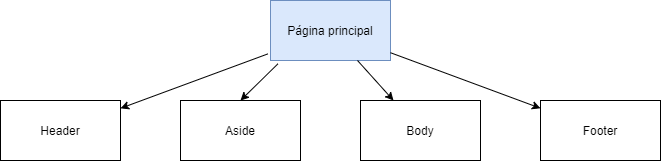

## DIU - Practica 2.

- Feedback Capture Grid: Malla Receptora De Información.

  |                                 Interesante                                 |                                           Críticas                                            |
  | :-------------------------------------------------------------------------: | :-------------------------------------------------------------------------------------------: |
  |                        1. Interfaz sencilla y clara.                        |             1. Las tiendas para ir a comprar que ofrece la web son caros ciudad.              |
  |                        2. Gran variedad de opciones.                        |                       2. No están actualizados los horarios por covid.                        |
  | 3. Ofrece muchas combinaciones de transporte público para ir por la ciudad. | 3. No está claro cuál de los sitios que presenta la web es el más característico de la ciudad |
  |        4. La página web es segura y cuenta con protección de datos.         |                             4. Falta de excursiones por la ciudad                             |
  |                                **Preguntas**                                |                                       **Nuevas ideas**                                        |
  |                              1. Modo nocturno                               |                         1. Añadir un comparador de coches de alquiler                         |
  |                             2. Chat para dudas.                             |                              2. Promociones por bonos o ventajas                              |
  |                      3. Opciones de airbnb en la web.                       |                          3. Promoción por número de amigos traídos.                           |
  |                  4. Bar tipico dónde probar la gastronomia                  |                                       4. Modo premium.                                        |
  |            5. Mas detalles en cuanto a las paradas de los buses.            |                       5. Penalización y bonificación por la asistencia.                       |

- Descripción del proyecto.

Nuestra aplicación contará con una serie de opciones de ocio para que nuestro usuario pueda elegir según sus gustos y preferencias. Contará con un menú con diversas opciones a elegir como:

- Deportes (running, natación…) donde aparecerá información asociada al respecto y aparecerán lugares o establecimientos donde practicarlos.
- Lugares con buena comida y bebida, apareciendo de esta manera información sobre dónde encontrar los mejores bares o restaurantes
- Música, conciertos y posibles actuaciones, conociendo así a posibles discotecas o pubs los cuales ofrezcan actuaciones que tengan lugar en nuestra ciudad.

Las ideas vamos a implementar:

    -Es que queremos que los grupos prevalezcan en el tiempo ya que queremos crear vínculos entre los integrantes. -Un calendario en el que podamos ver de forma mas visual las actividades inscritos.

    -Implementación de bonos o promociones para los usuarios.

    -Un modo premium que te libre de ciertos pagos y acceso a contenido exclusivo.

    -Un monedero para llevar un control de tus gastos.

    -Un modo oscuro.

- User/task matrix​: Matriz De Tareas y Usuarios.

|            GRUPOS DE USUARIOS            | Usuario | Usuario Premium | Usuarios no registrados | Establecimientos | Ranking |
| :--------------------------------------: | :-----: | :-------------: | :---------------------: | :--------------: | :-----: |
|                 Buscar.                  |  Alto   |      Alto       |           NO            |       Alto       |    9    |
|          Consultar Calendario.           |  Alto   |      Alto       |           NO            |       Bajo       |    7    |
| Consultar eventos en el establecimiento. |  Medio  |      Medio      |           NO            |      Medio       |    6    |
|            Consultar correo.             |  Medio  |      Medio      |           NO            |       Bajo       |    5    |
|        Consultar establecimiento.        |  Bajo   |      Bajo       |           NO            |       Alto       |    5    |
|             Cambiar idioma .             |  Bajo   |      Bajo       |           NO            |       Bajo       |    4    |
|             Iniciar sesión.              |  Bajo   |      Medio      |           NO            |       Bajo       |    4    |
|   Asistir a evento en establecimiento.   |  Medio  |      Medio      |           NO            |        NO        |    4    |
|             Consultar ayuda.             |  Bajo   |      Bajo       |          Bajo           |       Bajo       |    4    |
|             Poner Promoción.             |  Bajo   |      Bajo       |           NO            |      Medio       |    4    |
|            Quitar Promoción.             |  Bajo   |      Bajo       |           NO            |      Medio       |    4    |
|              Modo nocturno.              |  Bajo   |      Bajo       |           NO            |       Bajo       |    3    |
|              Enviar Correo.              |  Bajo   |      Bajo       |           NO            |       Bajo       |    3    |
|            Dejar de asistir.             |  Bajo   |      Bajo       |           NO            |        NO        |    2    |
|         Validar establecimiento.         |   NO    |       NO        |           NO            |       Bajo       |    1    |
|               Registrarse.               |   NO    |       NO        |          Bajo           |        NO        |    1    |
|         Introducir credenciales.         |   NO    |       NO        |          Bajo           |        NO        |    1    |
|             Hacerte premium.             |  Bajo   |       NO        |           NO            |        NO        |    1    |
|         Validar establecimiento.         |   NO    |       NO        |           NO            |       Bajo       |    1    |

- Arquitectura De La Información.

#### Sitemap​

Esquema principal.

Empezamos por la jerarquía del header .

Seguimos con la jerarquía del aside.

Continuamos con la jerarquía del body.

Finalizamos con el footer.

#### Labelling

| Término                 | Icono                                       | Significado                                                                                                                    |
| ----------------------- | ------------------------------------------- | ------------------------------------------------------------------------------------------------------------------------------ |
| Ajustes                 |          | Configuraciones del sistema y usuario.                                                                                         |
| Atrás                   |            | Permite volver a la pantalla anterior.                                                                                         |
| Google                  |           | permite registrarnos mediante nuestros datos de la cuenta de Google asociada.                                                  |
| Facebook                |         | permite registrarnos mediante nuestros datos de la cuenta de Facebook asociada.                                                |
| Buscador                |         | Nos permite acceder a distintos eventos o establecimientos mediante una búsqueda concreta..                                    |
| Correo                  |          | Se accede al apartado de mensajería donde podremos ver los mensajes y enviarlos.                                               |
| Calendario              |       | Se accede a un calendario donde veremos los eventos en el calendario                                                           |
| Extensión panel lateral |        | Se acceden a funcionalidades más específicas, como son: modo premium, establecimientos, eventos y ajustes                      |
| Idioma                  |                | Nos da la opción de elegir el idioma que queremos                                                                              |
| Modo nocturno           |          | Para comodidad del usuario se le da opción de usar el modo oscuro.                                                             |
| Notificaciones          |     | Novedades en los establecimientos, nuevos eventos, novedades en la aplicación, perfil, aviso de notificaciones personalizadas. |
| Perfil                  |           | Hace referencia a los datos del usuario: como son el nombre, imagen y contraseña                                               |
| Premium                 |          | Para el usuario general, se ofrece la posibilidad de hacer un perfil premium, para acceder a un perfil sin anuncios.           |
| Cerrar sesión           |          | Permite cerrar la sesión del usuario actual.                                                                                   |
| Ayuda                   |            | Acceso a panel de ayuda.                                                                                                       |
| Eventos                 |          | Acceso a la vista en la cual se mostrarán los eventos disponibles.                                                             |
| Establecimientos        |  | Acceso a la vista donde se podrán ver algunos establecimientos disponibles socios de la app.                                   |

- Wireframes:Bocetos de la interfaz.

#### 1.Menú.

#### 2.Aside.

#### 3.Búsqueda de eventos.

#### 4.Consulta de establecimientos.

#### 5.Mis eventos.

#### 6.Notificaciones.

#### 7.Calendario.

#### 8.Perfil.

#### 9.Ajustes.

