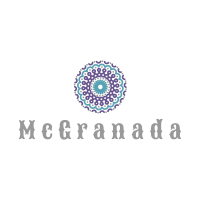
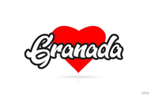
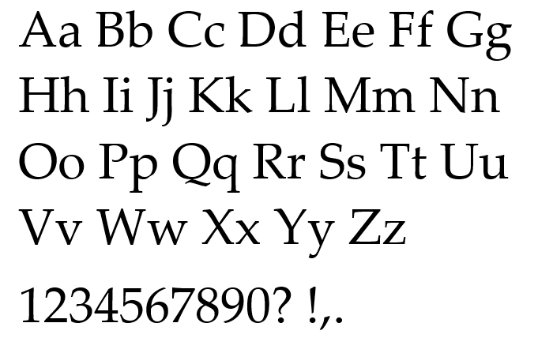
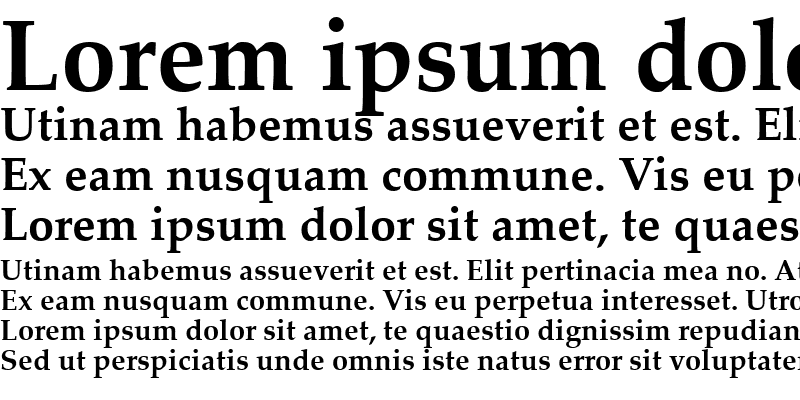
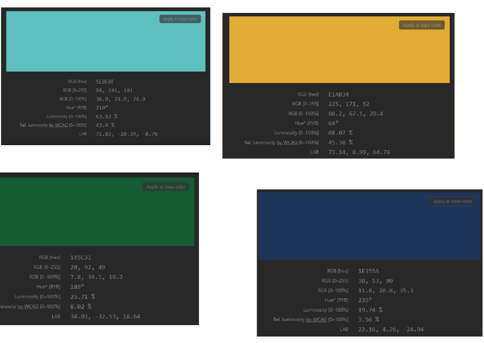
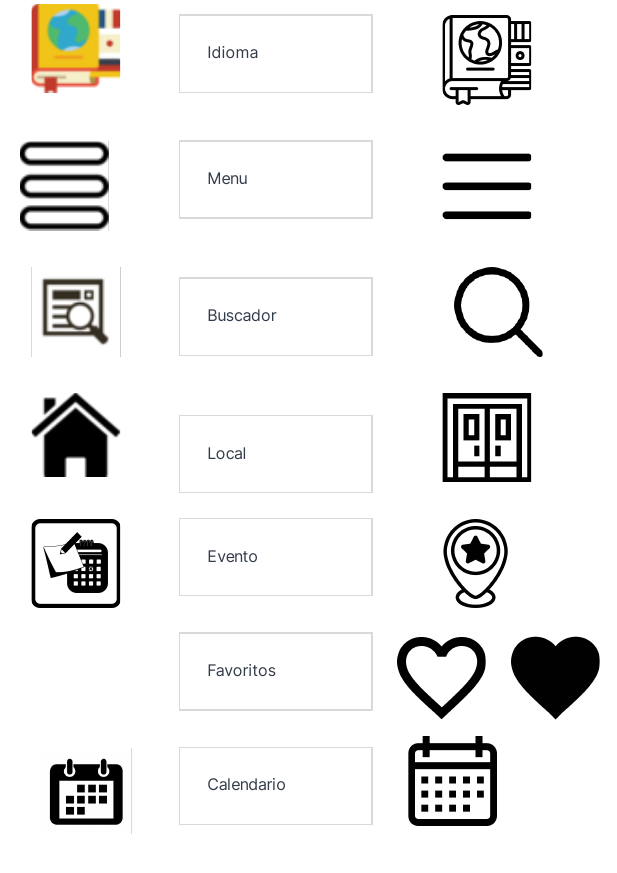

# DIU - Practica 3

## Case Study

McGranada una aplicación cuyo objetivo es dar a conocer las distintas actividades que se pueden realizar en Granada. Los pasos que hemos seguido para la obtencion de un prototipo han sido:

- Realizamos los bocetos y analizamos un caso de estudio de una aplicación, [Musemap](https://blog.prototypr.io/musemap-street-art-app-ux-case-study-9bec6a99823b):
- Lo primero que hicimos es pensar que podría necesitar un usuario que viene a Granada y necesita planes alternativos más allá de visitar monumentos.
- Tras pensar en que podrían necesitar los usuario se realizo una lista de features que podría incluir nuestra aplicación, con esta lista ya sería mas fácil a la hora de desarrollar la app priorizandolas.
- Con esta lista de features y las ideas que teniamos se procedió a realizar unos bocetos sencillos de como sería el aspecto de la app.
- Una vez que la maqueta final este lista sería necesario realizar una serie de pruebas para comprobar que cumple con todos los casos de uso de los usuarios.

## Logotipo

El logotipo final para este proyecto es:

Para ello la elección del logo final buscamos que fuese un logo que representara la ciudad de Granada y que fuese un diseño comtemporáneo

Para ellos descartamos algunas opciones como puede ser:

| Término  | Icono                         |
| -------- | ----------------------------- |
| Modelo 1 |  |
| Modelo 2 |  |
| Modelo 3 |  |

## Guideliness

- Decisiones sobre la tipografía:

Optamos por palatino ya que vimos que no era tan clásica como Times New Roman ni tan habitual como Comic Sans:

- Decisiones sobre la paleta de colores:

Al tratarse de una aplicación en la que sus principales usuario serán jovenes tratamos de elegir unos colores que fuese acorde aeso. Por ello optamos por algunos colores que estén de moda entre esa clase de personas como puede ser colores oscuros para el fondo de la app combinados con algunos colores más llamativos para resaltar todas las opciones que ofrecemos

Decisiones sobre la iconografía:

Algunos iconos de los bocetos han sido sustituidos debido a los nuevos diseños.

## Mockup

https://user-images.githubusercontent.com/46006326/118402470-4841ea00-b66a-11eb-821d-3724c7bdb5fe.mp4

## Valoración del equipo sobre la realización de esta práctica o los problemas surgidos

La realización de esta práctica nos ha hecho ver una manera distinta del proceso de desarrollo de una aplicación ya que antes principalmente nos centrabamos en el apartado más funcional como programadores. En consecuencia creemos que se ha notado la falta de experiencia a la hora del diseño de la misma. Por eso mismo es muy importatne que una vez desarrollada y lanzada la aplicación actualizarla en función del feedback de los usuarios e implementando nuevas caracteristicas a la misma.
