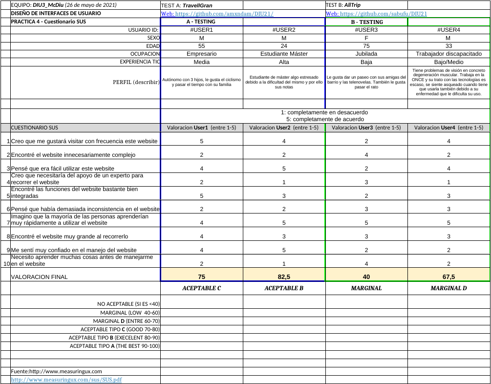

## 4.a Caso asignado

- Caso: AllTrip
- Github: https://github.com/sabufu/DIU21

El caso asignado consiste en una página web para la organización y planificación de viajes según los intereses del usuario, con valoraciones hacia viajes de otros usuarios..

La aplicación web permite crear viajes personalizables y compartirlos con el resto de usuario para que te lo puedan valorar e incluso realizar el mismo viaje.

## 4.b User Testing

Los perfiles de los cuatro usuarios que han realizado el test son los siguientes:

- Antonio 55 años, padre de familia y funcionario desde que tenía 26 años. Está bastante familiarizado con las tecnologías ya que las usa en su trabajo. Se siente feliz cuando la usa y le gusta experimentar y ver cosas nuevas en ella.
- Juan, de 24 años. Estudiante de máster. Estresado debido a la carga de trabajo y la dificultad del master. Se siente confiado con las tecnologías
- María, madre y abuela de 75 años. Jubilada. Sus aficiones son ver telenovelas y cotilleos en la tele y mirar por la ventana. No entiende mucho de tecnología y se siente un poco insegura al respecto.
- Alberto, 33 años. Tiene problemas de visión (degeneración muscular) . Trabaja en la ONCE. Su trato con la tecnología es escaso, y se siente asqueado e incluso cabreado cuando tiene que usarla también debido a su enfermedad que le dificulta su uso.

| Usuarios  | Sexo/Edad | Ocupación  | Exp.TIC | Personalidad | Plataforma | TestA/B |
| --------- | --------- | ---------- | ------- | ------------ | ---------- | ------- |
| María     | M / 18    | Estudiante | Media   | Extrovertida | App        | A       |
| Esperanza | M / 67    | Jubilada   | Baja    | Jovial       | App        | A       |
| Jose      | H / 23    | Estudiante | Alta    | Tranquila    | Web        | B       |
| Sonia     | M / 45    | Empresaria | Media   | Racional     | Web        | B       |

## 4.c Cuestionario SUS

Se ha realizado un cuestionario SUS para evaluar tanto la usabilidad de la Web del equipo `Alhucemas` que se nos ha asignado (Test A), como la del equipo `PCMasterRace` (Test B). Para rellenar el cuestionario se han utilizado los cuatro tipos diferentes de personas descritos anteriormente.

**Test A:**

- Antonio: 75 --> Aceptable Tipo C
- Juan: 82,5 --> Aceptable Tipo B

**Test B:**

- María: 40 --> Marginal
- Alberto: 67,5 --> Marginal Tipo D

## 4.d Usability Report

El documento con el informe de usabilidad para la web del grupo `PCMasterRace` se puede visualizar [aqui](DIU_report-template-usability-testOK_3.pdf)

**Conclusión**

No se entiende del todo el objetivo de la página web. Permite organizar tus viajes, eso está bien, pero solo permite elegir destino, punto de partida y se puede elegir vehículo de transporte al parecer, pero no deja claro en qué momento. No entiendo si hay más funcionalidad en cuanto a la hora de crear tu viaje, no deja claro si puedes añadir información (hay un botón pero no está claro). Además, puedes valorar otros viajes, pero no le veo el sentido real de para qué quieres valorar un viaje si no hay información aparte de la que ya hemos comentado.

Lo único que me ha quedado claro es que puedes elegir idioma, enviar un mensaje para solicitar ayuda (en el que tienes que indicar tu nombre, lo cual no le veo sentido porque se supone que el usuario ya está registrado) y que puedes recibir notificaciones, pero en ningún momento se indica cómo se pueden enviar. También se pueden gestionar los datos del perfil.
En resumen, la web no se entiende, ni cómo es (sus funcionalidades) ni su objetivo.
