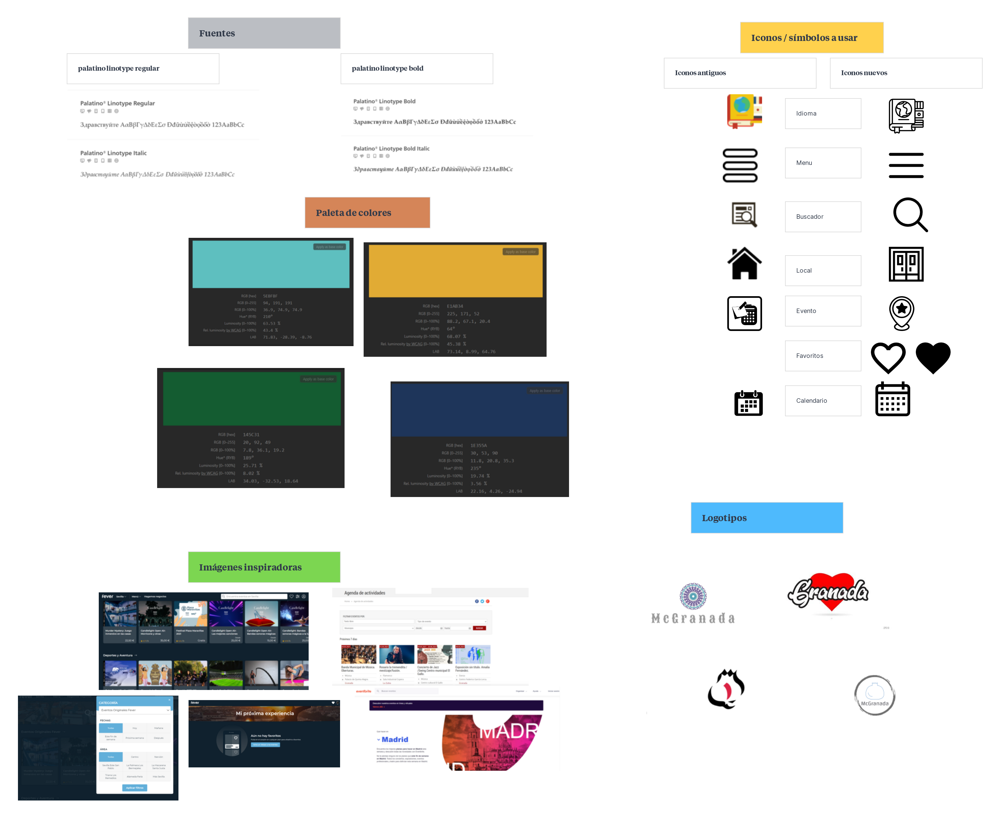

# DIU21

Prácticas Diseño Interfaces de Usuario 2020-21 (Tema: Turismo)

Grupo: DIU3_McDiu. Curso: 2020/21
Updated: 3/3/2021

Proyecto: McGranada

Descripción: Aplicación para buscar planes en Granada

Logotipo: 

Miembros

- :bust_in_silhouette: Pablo Martínez García :octocat:
- :bust_in_silhouette: Fernando Benavides Ruiz :octocat:

---

# Proceso de Diseño

## Paso 1. UX Desk Research & Analisis

##  1.a Competitive Analysis

> > > El objetivo de nuestra aplicación es mostrar planes alternativos a visitas de monumentos y centrarnos más en eventos y locales que puedan interesar. Hemos tomado como referencia Granada info ya que es una de las webs más completas relacionada con el turismo en la ciudad

##  1.b Persona

> > > Comenta brevemente porqué has seleccionado a esas personas y sube una captura de pantalla de su ficha (80-150 caracteres)

##  1.c User Journey Map

> > > Elegimos a personas las cuales visitaban Granada por primera vez o tras un largo periodo de tiempo, pudiendo asi valorar las necesidades que pudieran tener.

##  1.c User Journey Map

> > > Siguiendo el punto anterior vimos el proceso que tenían ambas personas a la hora de realizar dicho viaje y como organizar las cosas que querian hacer una vez llegaran.

##  1.d Usability Review

> > > Revisión de usabilidad: (toma los siguientes documentos de referncia y verifica puntos de verificación de usabilidad
> > >
> > > > Se deben incluir claramente los siguientes elementos
> > >
> > > - Enlace al documento:

      Ver [PDF](https://github.com/pablomarga/DIU/tree/main/P1/Usability-review.pdf)

> > > - Valoración final (numérica): 66
> > > - Comentario sobre la valoración: Nuestra página web cumple perfectamente con su objetivo: mostrar al usuario de una manera clara cuáles son las mejores opciones si quieres ir de viaje a granada, tanto en hoteles, rutas, tiendas para compras, sitios para comer…
> > >   La página web responde de una manera rápida y ofrece gran variedad de opciones (reservar hoteles, rutas, restaurantes, etc…). Sin embargo, no aparece la posibilidad de viajar con niños, punto muy en contra para las familias. Además, no aparecen feedbacks, lo que hace poco fiable la información o ayuda que nos puede llegar a ofrecer este sitio web, ya que la visión de otros usuarios es clave. Cuenta con varios atajos para acceder tanto a hoteles, restaurantes, etc… Esto puede ser de gran ayuda

|          ASPECTOS POSITIVOS           |             ASPECTOS NEGATIVOS              |
| :-----------------------------------: | :-----------------------------------------: |
|       Interfaz sencilla y clara       | No ofrece la posibilidad de viaje con niños |
|                Rápida                 |     Poca flexibilidad en la navegación      |
|       Mensajes de error claros        |     No hay posibilidad de dar feedback      |
|         Resultados precisos.          |       Difícil recuperación de errores       |
| Atajos y tareas fácilmente accesibles |        La ayuda online no es concisa        |

## Paso 2. UX Design

##  2.a Feedback Capture Grid

En la malla receptora hemos ido recopilando algunas de las características que vimos analizando la página en la práctica 1, con eso vimos algunas cosas a mejorar y sugerencias para nuevas funcionalidades.
| Interesante | Críticas |
| :-------------------------------------------------------------------------: | :-------------------------------------------------------------------------------------------: |
| 1. Interfaz sencilla y clara. | 1. Las tiendas para ir a comprar que ofrece la web son caros ciudad. |
| 2. Gran variedad de opciones. | 2. No están actualizados los horarios por covid. |
| 3. Ofrece muchas combinaciones de transporte público para ir por la ciudad. | 3. No está claro cuál de los sitios que presenta la web es el más característico de la ciudad |
| 4. La página web es segura y cuenta con protección de datos. | 4. Falta de excursiones por la ciudad |
| **Preguntas** | **Nuevas ideas** |
| 1. Modo nocturno | 1. Añadir un comparador de coches de alquiler |
| 2. Chat para dudas. | 2. Promociones por bonos o ventajas |
| 3. Opciones de airbnb en la web. | 3. Promoción por número de amigos traídos. |
| 4. Bar tipico dónde probar la gastronomia | 4. Modo premium. |
| 5. Mas detalles en cuanto a las paradas de los buses. | 5. Penalización y bonificación por la asistencia. |

##  2.b Tasks analysis

Entre las dos posibilidades nos hemos decidido por por hacer la matriz de tareas para analizar los usuarios que van a usar la aplicación y poder saber la frecuencia con la que tendrían que usar cada funcionalidad.

Para ver la matriz de usuario y tareas [pulse aquí](https://github.com/pablomarga/DIU/tree/master/P2)

##  2.c Labelling

Hemos seleccionado una serie de iconos para acceder a los diferentes apartados de la aplicación y que sean entendibles para el usuario
Para ver los distintos iconos que vamos a utilizar [pulse aquí](https://github.com/pablomarga/DIU/tree/main/P2#labelling)

##  2.d Wireframes

En este apartado hemos desarrollado una serie de bocetos de las distintas partes de la aplicación. Primero realizamos unos diagrama de flujo y tras este comenzamos con los bocetos.

Para ver los diagramas y su correspondiente explicación [pulse aquí](https://github.com/pablomarga/DIU/tree/main/P2#1men%C3%BA)

## Paso 3. Mi UX-Case Study (diseño)

##  3.a Moodboard

##  3.b Landing Page

Puede consultar nuestra langing page [aqui](https://mcgranada.kickoffpages.com) en la cual incluimos una promoción por la cuál al invitar a amigos podrás ganar descuentos.

##  3.c Guidelines

Se trata de elementos que facilitan la usabilidad y legibilidad de la app y si están bien empleados repercutirán de forma positiva sobre nuestra app de cara al usuario.
Al tratarse de una aplicación en la que sus principales usuario serán jovenes tratamos de elegir unos colores que fuese acorde a eso. Por ello optamos por algunos colores que estén de moda entre esa clase de personas como puede ser colores oscuros para el fondo de la app combinados con algunos colores más llamativos para resaltar todas las opciones que ofrecemos.

Para más información [pulse aquí](https://github.com/pablomarga/DIU/tree/main/P3#guideliness)

##  3.d Mockup

##  3.e ¿My UX-Case Study?

> > > Publicar my Case Study en Github..
> > > Documente y resuma el diseño de su producto en forma de video de 90 segundos aprox

## Paso 4. Evaluación

##  4.a Caso asignado

> > > Breve descripción del caso asignado con enlace a su repositorio Github

##  4.b User Testing

> > > Seleccione 4 personas ficticias. Exprese las ideas de posibles situaciones conflictivas de esa persona en las propuestas evaluadas. Asigne dos a Caso A y 2 al caso B

| Usuarios     | Sexo/Edad | Ocupación  | Exp.TIC | Personalidad | Plataforma | TestA/B |
| ------------ | --------- | ---------- | ------- | ------------ | ---------- | ------- |
| User1's name | H / 18    | Estudiante | Media   | Introvertido | Web.       | A       |
| User2's name | H / 18    | Estudiante | Media   | Timido       | Web        | A       |
| User3's name | M / 35    | Abogado    | Baja    | Emocional    |  móvil     | B       |
| User4's name | H / 18    | Estudiante | Media   | Racional     |  Web       | B       |

## . 4.c Cuestionario SUS

> > > Usaremos el **Cuestionario SUS** para valorar la satisfacción de cada usuario con el diseño (A/B) realizado. Para ello usamos la [hoja de cálculo](https://github.com/mgea/DIU19/blob/master/Cuestionario%20SUS%20DIU.xlsx) para calcular resultados sigiendo las pautas para usar la escala SUS e interpretar los resultados
> > > http://usabilitygeek.com/how-to-use-the-system-usability-scale-sus-to-evaluate-the-usability-of-your-website/)
> > > Para más información, consultar aquí sobre la [metodología SUS](https://cui.unige.ch/isi/icle-wiki/_media/ipm:test-suschapt.pdf)

> > > Adjuntar captura de imagen con los resultados + Valoración personal

##  4.d Usability Report

> > Añadir report de usabilidad para práctica B (la de los compañeros)

> > > Valoración personal

## Conclusión final / Valoración de las prácticas

Como conclusión final, estas prácticas nos han resultado bastante útiles a la hora del desarrollo de una aplicación. Hemos aprendido qué elementos habría que diseñar y cuáles no, partes del proceso de desarrollo de la aplicación o web y de diseño de interfaz. Nos ha parecido útil a la hora de posibles futuros proyectos o trabajos, además de lo útil que resulta un trabajo colectivo y aprender de tus errores y de los de tu compañero también.
No habíamos pensado que una aplicación era tan compleja a la hora de elegir colores, qué elementos y cómo van en la portada, footer, aside, etc. Además de tener en cuenta la accesibilidad de ésta.
Creo que hemos mejorado la manera en la que enfocarnos a la hora de desarrollar una web/app gracias a esta asignatura y nos va a resultar útil seguro para un futuro.

# DIU
